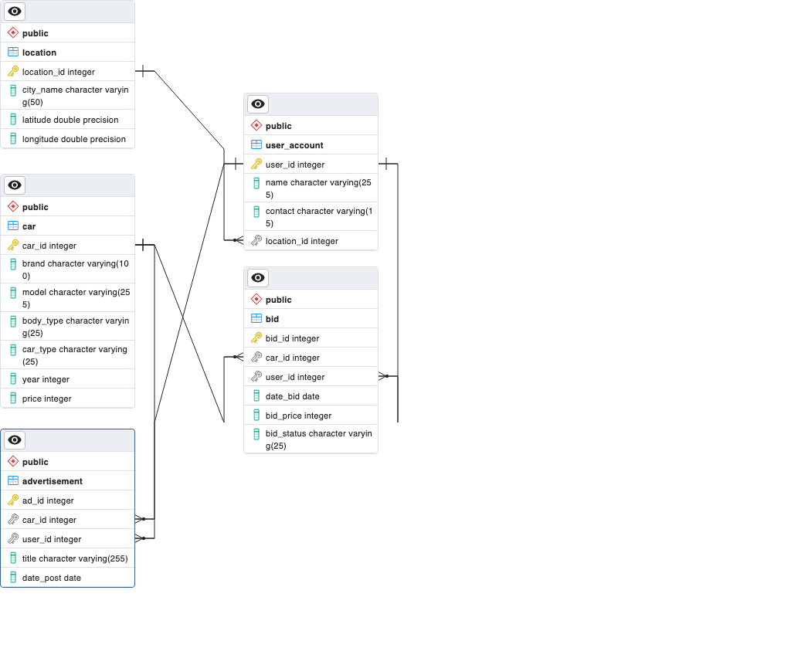

# Final Project Relational Database & SQL

## Description
Lorem ipsum dolor

## Entity Relation Diagram (ERD)


## Syntax DDL
```sql
-- Location Table
CREATE TABLE location (
  location_id SERIAL PRIMARY KEY,
  city_name VARCHAR(50) NOT NULL,
  latitude FLOAT NOT NULL,
  longitude FLOAT NOT NULL
);

-- Car Table
CREATE TABLE car (
  car_id SERIAL PRIMARY KEY,
  brand VARCHAR(100) NOT NULL,
  model VARCHAR(255) NOT NULL,
  body_type VARCHAR(25) NOT NULL,
  car_type VARCHAR(25) NOT NULL,
  year INT NOT NULL,
  price INT NOT NULL
);

-- User Account Table
CREATE TABLE user_account (
  user_id SERIAL PRIMARY KEY,
  name VARCHAR(255) NOT NULL,
  contact VARCHAR(15) NOT NULL,
  location_id INT NOT NULL,
  FOREIGN KEY (location_id) REFERENCES location(location_id)
);

-- Advertisement Table
CREATE TABLE advertisement (
  ad_id SERIAL PRIMARY KEY,
  car_id INT NOT NULL,
  user_id INT NOT NULL,
  title VARCHAR(255) NOT NULL,
  FOREIGN KEY (car_id) REFERENCES car(car_id),
  FOREIGN KEY (user_id) REFERENCES user_account(user_id)
);


-- Bid Table
CREATE TABLE bid (
  bid_id SERIAL PRIMARY KEY,
  car_id INT NOT NULL,
  user_id INT NOT NULL,
  date_bid DATE NOT NULL,
  bid_price INT NOT NULL,
  bid_status VARCHAR(25) NOT NULL,
  FOREIGN KEY (car_id) REFERENCES car(car_id),
  FOREIGN KEY (user_id) REFERENCES user_account(user_id)
);


```

## Dummy dataset
Dummy dataset created using Python and additional libraries. Once dummy dataset created successfully, it will import to database using Python. Check complete code in [here 🧑‍💻](/generate-dummy-dataset/) and results in [here 🚀](/assets/)
## Transactional Query

## Analytical Query
