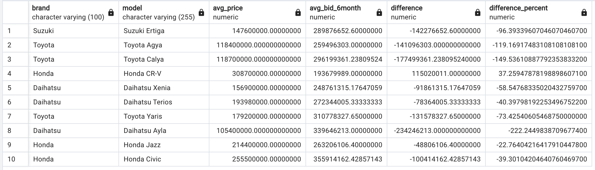

# Selling Used Cars Online - Final Project Relational Database & SQL

## Description
Creating a database for a project or application and understanding the data retrieval process is one of the tasks of Software & Data Engineering.

In this project, you are given the task of building a relational database for a website that offers used car sales. The general description of this project is that anyone can offer their products (used cars) in the form of advertisements and potential buyers can search based on several categories.

For more details, here are the features and limitations of this project:
1. Each application user can offer more than one used car product.
2. Before selling a car product, the user must first complete his personal data, such as name, contact, and location domicile.
3. Users offer their products through advertisements that will be displayed on the website.
4. This ad contains a title, detailed product information offered, and seller contact.
5. Some of the information that must be written in the ad is as follows
   - car brand: Toyota, Daihatsu, Honda, etc
   - Model: Toyota Camry, Toyota Corolla Altis, Toyota Vios,Toyota Camry Hybrid, etc
   - Car body type: MPV, SUV, Van, Sedan, Hatchback, etc
   - Car type: manual or automatic
   - Car manufacture year: 2005, 2010, 2011, 2020

	Other descriptions, such as color, distance traveled, etc., may be added as needed.
6. Each user can search for the cars offered based on the location of the seller user, the car brand, and the type of car body.
7. If a potential buyer is interested in a car, he can bid on the price of the product if the seller allows the bidding feature.
8. Purchase transactions are made outside the application so they are not within the scope of the project

## Entity Relation Diagram (ERD)


## Syntax DDL
```sql
-- Location Table
CREATE TABLE location (
  location_id SERIAL PRIMARY KEY,
  city_name VARCHAR(50) NOT NULL,
  latitude FLOAT NOT NULL,
  longitude FLOAT NOT NULL
);

-- Car Table
CREATE TABLE car (
  car_id SERIAL PRIMARY KEY,
  brand VARCHAR(100) NOT NULL,
  model VARCHAR(255) NOT NULL,
  body_type VARCHAR(25) NOT NULL,
  car_type VARCHAR(25) NOT NULL,
  year INT NOT NULL,
  price INT NOT NULL
);

-- User Account Table
CREATE TABLE user_account (
  user_id SERIAL PRIMARY KEY,
  name VARCHAR(255) NOT NULL,
  contact VARCHAR(15) NOT NULL,
  location_id INT NOT NULL,
  FOREIGN KEY (location_id) REFERENCES location(location_id)
);

-- Advertisement Table
CREATE TABLE advertisement (
  ad_id SERIAL PRIMARY KEY,
  car_id INT NOT NULL,
  user_id INT NOT NULL,
  title VARCHAR(255) NOT NULL,
  FOREIGN KEY (car_id) REFERENCES car(car_id),
  FOREIGN KEY (user_id) REFERENCES user_account(user_id)
);


-- Bid Table
CREATE TABLE bid (
  bid_id SERIAL PRIMARY KEY,
  car_id INT NOT NULL,
  user_id INT NOT NULL,
  date_bid DATE NOT NULL,
  bid_price INT NOT NULL,
  bid_status VARCHAR(25) NOT NULL,
  FOREIGN KEY (car_id) REFERENCES car(car_id),
  FOREIGN KEY (user_id) REFERENCES user_account(user_id)
);


```

## Dummy dataset
Dummy dataset created using Python and additional libraries. Once dummy dataset created successfully, it will import to database using Python. Below is example one of functions to generate dummy dataset.

> Check complete code in [here 🧑‍💻](/generate-dummy-dataset/) and results in [here 🚀](/assets/dummy-dateset)

```python
def generate_dummy_user():
    # Generate dummy data
    num_records = 100  # Number of records to generate
    header = ['user_id', 'name', 'contact', 'location_id']
    data = []

    # Read city data from city.csv
    with open('../assets/dummy-dataset/city.csv', 'r') as city_file:
        city_reader = csv.DictReader(city_file)
        cities = list(city_reader)

        # Generate dummy data with location_id from city data
        for i in range(num_records):
            city = random.choice(cities)
            location_id = city['kota_id']
            data.append([i+1, fake.name(), fake.msisdn(), location_id])

    # Export data to CSV file
    filename = '../assets/dummy-dataset/user_dummy_dataset.csv'
    with open(filename, 'w', newline='') as file:
        writer = csv.writer(file)
        writer.writerow(header)
        writer.writerows(data)

    print(f"Dummy dataset created and exported as {filename}")
```

## Transactional Query
1. Looking for cars from 2015 and up.

```sql
SELECT * FROM car WHERE year >= 2015;
```


2. Added one new product bid record.
  
```sql
INSERT INTO bid (car_id, user_id, date_bid, bid_price, bid_status)
VALUES (1,2,'2023-03-04',355500000,'Sent');
```


3. View all cars sold 1 account from the most recent.
  
```sql
SELECT c.car_id, c.brand, c.model, c.year, c.price, a.date_post
FROM car c
JOIN advertisement a ON c.car_id = a.car_id
JOIN user_account u ON a.user_id = u.user_id
WHERE u.name = 'Febi Mustofa';
```


4. Search for the cheapest used cars based on keywords.
  
```sql
SELECT car_id, brand, model, year, price
FROM Car
WHERE LOWER(model) LIKE '%yaris%'
ORDER BY price ASC;
```


5. Looking for the nearest used car based on a `city id`, the shortest distance is calculated based on latitude longitude. Distance calculations can be calculated using the euclidean distance formula based on latitude and longitude.
  
```sql
SELECT c.car_id, c.brand, c.model, c.year, c.price
FROM car c
JOIN advertisement a ON c.car_id = a.car_id
JOIN user_account u ON a.user_id = u.user_id
JOIN location l ON u.location_id = l.location_id
WHERE l.location_id = 3171
ORDER BY SQRT(POW(l.latitude - (-6.186486), 2) + POW(l.longitude - 106.834091, 2));
```

## Analytical Query
1. Car model popularity ranking based on bid amount.
  
```sql
SELECT c.model, COUNT(distinct c.car_id) as count_product, COUNT(b.bid_id) as count_bid
FROM car c
LEFT JOIN advertisement a ON c.car_id = a.car_id
LEFT JOIN bid b ON a.car_id = b.car_id
GROUP BY c.model
ORDER BY count_bid DESC;
```


2. Compare car prices based on the average price per city.
  
```sql
SELECT l.city_name, c.brand, c.model, c.year, c.price, avg_price.avg_car_city
FROM car c
JOIN (
    SELECT u.location_id, AVG(c.price) AS avg_car_city
    FROM advertisement a
    JOIN user_account u ON a.user_id = u.user_id
    JOIN car c ON a.car_id = c.car_id
    JOIN location l ON u.location_id = l.location_id
    GROUP BY u.location_id
) AS avg_price ON avg_price.location_id = c.car_id
JOIN Location l ON avg_price.location_id = l.location_id
ORDER BY avg_price.avg_car_city ASC;
```


3. From the offer for a car model, look for a comparison of the date the user made a bid with the next bid along with the bid price given.
  
```sql
SELECT c.model, b1.user_id, b1.date_bid AS first_bid_date, b2.date_bid AS next_bid_date, b1.bid_price AS first_bid_price, b2.bid_price AS next_bid_price
FROM bid b1
JOIN bid b2 ON b1.car_id = b2.car_id AND b1.date_bid < b2.date_bid
JOIN car c ON b1.car_id = c.car_id
WHERE c.model = 'Toyota Yaris'
ORDER BY b1.date_bid ASC;
```


4. Comparing the percentage difference in the average car price by model and the average bid price offered by customers in the last 6 months.
  
```sql
WITH avg_car_price AS (
    SELECT
        brand,
        model,
        AVG(price) AS avg_price
    FROM
        car
    GROUP BY
        brand, model
),
avg_bid_6month AS (
    SELECT
        c.brand,
        c.model,
        AVG(b.bid_price) AS avg_bid_6month
    FROM
        bid b
    JOIN
        advertisement a ON b.car_id = a.car_id
    JOIN
        car c ON a.car_id = c.car_id
    WHERE
        b.date_bid >= current_date - interval '6 months'
    GROUP BY
        c.brand, c.model
)
SELECT
    acp.brand,
    acp.model,
    acp.avg_price,
    COALESCE(ab.avg_bid_6month, 0) AS avg_bid_6month,
    acp.avg_price - COALESCE(ab.avg_bid_6month, 0) AS difference,
    (acp.avg_price - COALESCE(ab.avg_bid_6month, 0)) / acp.avg_price * 100 AS difference_percent
FROM
    avg_car_price acp
LEFT JOIN
    avg_bid_6month ab ON acp.brand = ab.brand AND acp.model = ab.model;
```


5. Create a window function of the average bid price of a car brand and model for the last 6 months.
  
```sql
SELECT
    brand,
    model,
    AVG(CASE WHEN extract(month FROM b.date_bid) = extract(month FROM current_date) - 6 THEN b.bid_price ELSE NULL END) AS m_min_6,
    AVG(CASE WHEN extract(month FROM b.date_bid) = extract(month FROM current_date) - 5 THEN b.bid_price ELSE NULL END) AS m_min_5,
    AVG(CASE WHEN extract(month FROM b.date_bid) = extract(month FROM current_date) - 4 THEN b.bid_price ELSE NULL END) AS m_min_4,
    AVG(CASE WHEN extract(month FROM b.date_bid) = extract(month FROM current_date) - 3 THEN b.bid_price ELSE NULL END) AS m_min_3,
    AVG(CASE WHEN extract(month FROM b.date_bid) = extract(month FROM current_date) - 2 THEN b.bid_price ELSE NULL END) AS m_min_2,
    AVG(CASE WHEN extract(month FROM b.date_bid) = extract(month FROM current_date) - 1 THEN b.bid_price ELSE NULL END) AS m_min_1
FROM
    car c
    JOIN advertisement a ON c.car_id = a.car_id
    JOIN bid b ON a.car_id = b.car_id
WHERE
    c.brand = 'Toyota' AND c.model = 'Toyota Agya'
    AND b.date_bid >= current_date - interval '6 months'
GROUP BY
    c.brand, c.model
ORDER BY
    c.brand, c.model;
```

